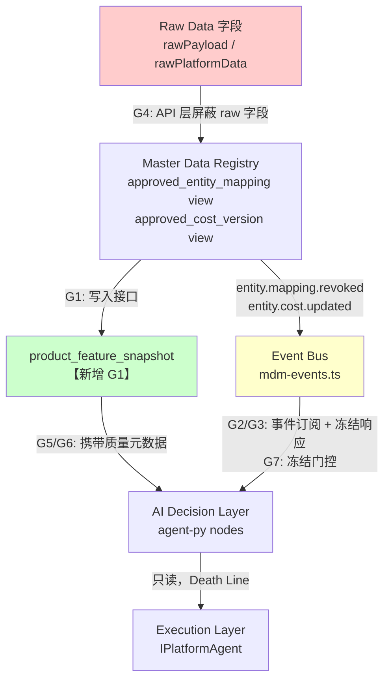
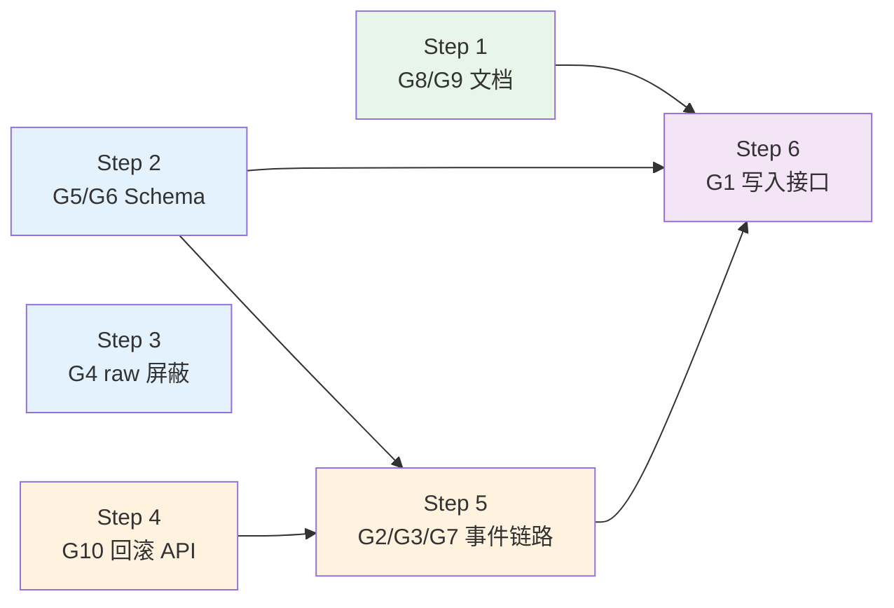

## 目标

修复审计发现的 10 个数据隔离缺口，加固 Master Data 与 AI 决策层之间的边界，防止系统自我污染。

## 数据流与修复范围总览



---

## Step 1：G8 — AI_CODING_RULES.md 补充隔离规范

**目标文件：** `AI_CODING_RULES.md`

在现有前置检查清单末尾追加两条：
- `[ ] **Raw 字段屏蔽？** AI 可访问端点是否过滤了 rawPayload / rawPlatformData / rawData？`
- `[ ] **数据质量门控？** 决策前是否检查 dataQualityScore >= 0.7 且 featureFrozen = false？`

新增「**14. Master Data 隔离规范**」章节，包含：

```typescript
// ❌ 禁止：mapping 状态反向过滤
WHERE mapping.status != 'REJECTED'

// ✅ 正确：显式 APPROVED 过滤
WHERE mapping.status = 'APPROVED'
  AND (effectiveTo IS NULL OR effectiveTo > now())
```

```typescript
// ❌ 禁止：无时间窗口的成本查询
SELECT * FROM CostVersion WHERE productGlobalId = $id

// ✅ 正确
SELECT * FROM CostVersion
WHERE productGlobalId = $id
  AND effectiveFrom <= now()
  AND (effectiveTo IS NULL OR effectiveTo > now())
  AND status = 'ACTIVE'
```

```typescript
// ❌ 禁止：AI 端点返回含 raw 字段的响应
// ✅ 正确：AI 专属端点只暴露 approved_entity_mapping / approved_cost_version 视图
```

新增「**15. Flywheel / Bandit 身份绑定规范**」（G9）：
- Flywheel 核心 ID 必须使用 `Product_Global_ID`，禁止 `ASIN` / `SKU` / `ERP Code`
- Bandit arm 必须定义为 `Arm_ID = Listing_Global_ID`，禁止 `ASIN`
- 常见违规示例条目

**验证：** 文件存在且新增两节内容完整

---

## Step 2：G5/G6 — Prisma schema 扩展数据质量字段

**目标文件：** `packages/database/prisma/schema.prisma`

### 2a. `Product` 模型追加字段

```prisma
dataQualityScore    Float?   // 0.0–1.0，< 0.7 时 AI 跳过优化
featureFrozen       Boolean  @default(false)  // 实体冻结中
featureFrozenReason String?  // 冻结原因（mapping_revoked / cost_updated）
lastVerifiedAt      DateTime?               // 特征最后验证时间
```

### 2b. `ExternalIdMapping` 模型追加字段

`confidenceScore` 已存在，无需改动。追加：
```prisma
mappingConfidencePassedAt  DateTime?  // 最后一次置信度达标时间（>= 0.7）
```

### 2c. 新增 `ProductFeatureSnapshot` 模型（G1）

```prisma
model ProductFeatureSnapshot {
  id               String   @id @default(uuid()) @db.Uuid
  tenantId         String   @db.Uuid
  productGlobalId  String   @db.Uuid
  snapshotDate     DateTime @db.Date
  totalSales       Decimal? @db.Decimal(14, 2)
  totalAdSpend     Decimal? @db.Decimal(14, 2)
  profit           Decimal? @db.Decimal(14, 2)
  inventory        Int?
  acos             Decimal? @db.Decimal(5, 4)
  roas             Decimal? @db.Decimal(8, 4)
  dataQualityScore Float    @default(0)
  mappingConfidence Float   @default(0)
  sourceMapping    String?  // 来源 mapping ID
  createdAt        DateTime @default(now())
  updatedAt        DateTime @updatedAt

  @@unique([tenantId, productGlobalId, snapshotDate])
  @@index([tenantId, productGlobalId, snapshotDate(sort: Desc)])
  @@index([tenantId, snapshotDate])
}
```

### 2d. 生成 migration

```bash
pnpm --filter @repo/database prisma migrate dev \
  --name add_data_quality_and_feature_snapshot
```

**验证：** `prisma migrate status` 显示 migration applied；`Product` 表含新字段；`ProductFeatureSnapshot` 表存在

---

## Step 3：G4 — API 层屏蔽 raw 字段

**目标文件：** `apps/api/src/mdm-asset-routes.ts`、`apps/api/src/mdm-mapping-routes.ts`

### 3a. Listing 端点过滤 `rawPlatformData`

在 `GET /mdm/listings` 和 `GET /mdm/listings/:id` 的响应中，通过 Prisma `select` 排除 `rawPlatformData`：

```typescript
// 在 findMany / findFirst 查询中添加 select 配置
select: {
  id: true, tenantId: true, commodityId: true, platformId: true,
  externalListingId: true, title: true, isPrimary: true,
  status: true, mappingStatus: true, mappedBy: true, mappedAt: true,
  createdAt: true, updatedAt: true,
  // rawPlatformData: 显式排除
}
```

### 3b. ExternalIdMapping 端点过滤 `rawPayload` / `candidatePayload`

在 `GET /mdm/mappings` 和 `GET /mdm/mappings/:id` 的响应中排除：
```typescript
// rawPayload 和 candidatePayload 不出现在 select 中
```

> **例外**：`/mdm/mappings/approved` 端点已使用 approved 视图，本身不含 raw 字段，无需改动。

### 3c. ExternalSkuMapping 端点过滤 `rawData`

在 `GET /mdm/sku-mappings` 响应中排除 `rawData` 字段。

**验证：** 调用上述端点，响应 JSON 中不存在 `rawPayload` / `rawPlatformData` / `rawData` / `candidatePayload` 键

---

## Step 4：G10 — Mapping 回滚 API

**目标文件：** `apps/api/src/mdm-mapping-routes.ts`

新增端点 `POST /mdm/mappings/:id/rollback`：

```typescript
// 逻辑：
// 1. 查找 MappingHistory 中最近一条 oldStatus = 'APPROVED' 的记录
// 2. 将当前 mapping.status 回退到该状态
// 3. 写入 MappingHistory（action: 'rollback'）
// 4. emit EntityMappingRevokedEvent（mode: 'MANUAL'）触发冻结链路
// 5. 返回回滚结果及影响范围（productGlobalId）

// 权限：仅 tenant_admin 可操作
// 约束：仅允许回滚最近一步，不支持多步回滚
```

**验证：** 回滚后 mapping.status 恢复到上一有效状态；MappingHistory 有新记录；相关 Product.featureFrozen = true

---

## Step 5：G2/G3/G7 — 事件订阅契约 + 实体冻结响应链路

### 5a. 完善事件总线消费接口（`apps/api/src/mdm-events.ts`）

新增 `MasterDataEventHandler` 接口契约：

```typescript
export interface MasterDataEventHandler {
  onMappingRevoked(event: EntityMappingRevokedEvent): Promise<void>;
  onCostUpdated(event: EntityCostUpdatedEvent): Promise<void>;
  onProductUpdated(event: ProductUpdatedEvent): Promise<void>;
}
```

新增 `registerMasterDataHandlers(handler: MasterDataEventHandler)` 辅助函数，将三个事件类型批量注册到 `onMdmEvent`。

### 5b. 新增事件处理器（`apps/api/src/mdm-isolation-handler.ts`）

实现 `MasterDataEventHandler`，处理逻辑：

**`onMappingRevoked`：**
```typescript
// 1. 通过 globalId 查找关联 Product
// 2. 设置 Product.featureFrozen = true, featureFrozenReason = 'mapping_revoked'
// 3. 写入 SecurityAuditEvent（eventType: 'entity_frozen', severity: 'HIGH'）
// 4. TODO Phase 2: 触发 Feature Builder 重算
```

**`onCostUpdated`：**
```typescript
// 1. 将 ProductFeatureSnapshot 中 productGlobalId 匹配的最新快照标记为过期
//    （通过 dataQualityScore = 0 降权，而非删除，保留审计）
// 2. 写入 SecurityAuditEvent（eventType: 'cost_version_changed'）
```

**`onProductUpdated`（changedFields 含 asin）：**
```typescript
// 1. 设置 Product.featureFrozen = true, featureFrozenReason = 'asin_changed'
// 2. 写入 SecurityAuditEvent（eventType: 'asin_merge_detected'）
// 3. TODO Phase 2: 清空 Bandit 权重
```

在 `apps/api/src/server.ts` 启动时调用 `registerMasterDataHandlers(new MdmIsolationHandler(db))`。

### 5c. agent-py 数据质量门控（`apps/agent-py/src/nodes/validate_freshness.py`）

在现有 `validate_freshness` 节点中追加门控逻辑：

```python
# 从 signal_context 或 commodity_plan 中读取质量元数据
quality = state.get("signal_context", {}).get("quality_meta", {})
data_quality_score = quality.get("data_quality_score", 1.0)
feature_frozen = quality.get("feature_frozen", False)

if data_quality_score < 0.7:
    state["outcome"] = {
        "status": "SKIPPED_LOW_QUALITY",
        "reason": f"data_quality_score={data_quality_score} below threshold 0.7"
    }
    return state

if feature_frozen:
    state["outcome"] = {
        "status": "SKIPPED_ENTITY_FROZEN",
        "reason": quality.get("frozen_reason", "entity_frozen_pending_rebuild")
    }
    return state
```

**验证：**
- `featureFrozen = true` 的 Product 在 API 侧写入事件后，`SecurityAuditEvent` 有对应记录
- agent-py `validate_freshness` 节点在 `data_quality_score < 0.7` 时返回 `SKIPPED_LOW_QUALITY`
- 事件处理器在 `onMappingRevoked` 后 Product 的 `featureFrozen` 字段为 `true`

---

## Step 6：G1 — ProductFeatureSnapshot 写入接口

**目标文件：** `apps/api/src/server.ts`（或新建 `apps/api/src/feature-routes.ts`）

新增端点 `POST /features/product/:globalId/snapshot`（仅内部服务调用，需 `system` scope）：

```typescript
// 请求体：
{
  snapshotDate: string,       // YYYY-MM-DD
  totalSales: number,
  totalAdSpend: number,
  profit: number,
  inventory: number,
  acos: number,
  roas: number,
  dataQualityScore: number,   // 由调用方基于 mapping confidence 计算
  mappingConfidence: number,
  sourceMapping: string       // ExternalIdMapping.id
}
// 逻辑：upsert on (tenantId, productGlobalId, snapshotDate)
// 同时更新 Product.dataQualityScore = 请求体的值，Product.lastVerifiedAt = now()
```

新增查询端点 `GET /features/product/:globalId/latest`（AI 层只读）：

```typescript
// 返回最近 N 天的快照（默认 30 天）
// 仅返回 dataQualityScore >= 0.7 的记录
// 不含任何 raw 字段
```

**验证：** POST 写入后 GET 可查询；低质量快照（score < 0.7）不出现在 GET 响应中

---

## 完整修复追踪矩阵

| 缺口 | Step | 目标文件 | 验证标准 |
|------|------|---------|---------|
| G1 Feature Store 单表 | Step 2c + Step 6 | `schema.prisma` + `feature-routes.ts` | 表存在，写入/查询接口可用 |
| G2 事件总线消费契约 | Step 5a | `mdm-events.ts` | `MasterDataEventHandler` 接口定义存在 |
| G3 agent-py 事件响应 | Step 5c | `validate_freshness.py` | 质量门控逻辑可运行 |
| G4 raw 字段屏蔽 | Step 3 | `mdm-asset-routes.ts` `mdm-mapping-routes.ts` | API 响应无 raw 字段 |
| G5 dataQualityScore 字段 | Step 2a | `schema.prisma` | 字段存在，migration applied |
| G6 mappingConfidence 传链 | Step 2b + Step 6 | `schema.prisma` + `feature-routes.ts` | 快照携带 mappingConfidence |
| G7 异常冻结链路 | Step 5b | `mdm-isolation-handler.ts` | REVOKED 后 featureFrozen=true |
| G8 编码规范文档 | Step 1 | `AI_CODING_RULES.md` | 新增两节内容完整 |
| G9 Bandit 绑定规范 | Step 1 | `AI_CODING_RULES.md` | 第15节存在且包含禁止示例 |
| G10 Mapping 回滚 API | Step 4 | `mdm-mapping-routes.ts` | 回滚后状态恢复，审计记录存在 |

## 实施顺序依赖关系



- **Step 1、2、3 无依赖，可并行**
- **Step 4 无依赖，可与 1/2/3 并行**
- **Step 5 依赖 Step 2（schema 字段）和 Step 4（回滚触发冻结）**
- **Step 6 依赖 Step 2（schema 表）和 Step 5（事件链路就绪）**

## 完成定义（DoD）

- [ ] `prisma migrate status` 无 pending migration
- [ ] `GET /mdm/listings` 响应中不含 `rawPlatformData` 键
- [ ] `GET /mdm/mappings` 响应中不含 `rawPayload` / `candidatePayload` 键
- [ ] `POST /mdm/mappings/:id/revoke` 后对应 `Product.featureFrozen = true`
- [ ] `POST /mdm/mappings/:id/rollback` 可正常回滚，MappingHistory 有记录
- [ ] agent-py `validate_freshness` 节点在 `data_quality_score < 0.7` 时输出 `SKIPPED_LOW_QUALITY`
- [ ] `AI_CODING_RULES.md` 包含第14、15节隔离规范
- [ ] `lint_death_line.py` 运行通过（无新引入违规）
