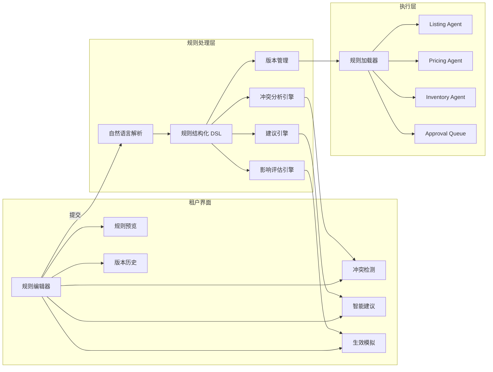

# 多租户 SaaS 可视化业务规则系统设计与实施方案

## 1. 目标与范围
本方案面向多租户跨境电商系统，提供可视化规则配置能力，支持：
- 自然语言规则输入与结构化解析
- 实时冲突检测与修复建议
- 智能优化建议
- 规则版本管理与回滚
- 生效影响预览与安全发布

适配当前工程基础：
- `apps/web`：Dashboard 前端
- `apps/api`：Hono + pg-boss + Policy/Governance
- `apps/agent-py`：LangGraph Agent Runtime
- `packages/database`：PostgreSQL + Prisma

---

## 2. 总体架构


---

## 3. 规则模型设计（新增）

## 3.1 核心实体
1. `RuleSet`：租户规则集（按租户唯一、可多版本）
2. `RuleDefinition`：单条结构化规则（DSL）
3. `RuleConflict`：冲突检测记录
4. `RuleSuggestion`：系统建议记录
5. `RuleVersion`：版本快照与变更元数据
6. `RuleSimulationRun`：预览模拟任务与结果

## 3.2 DSL 建议结构
```json
{
  "id": "rule_...",
  "domain": "ads|pricing|inventory|listing",
  "priority": 100,
  "when": {
    "all": [
      {"field": "inventoryDays", "op": "<", "value": 7},
      {"field": "isNewProduct", "op": "=", "value": false}
    ]
  },
  "then": [
    {"action": "pause_ads", "params": {"reason": "LOW_STOCK"}}
  ],
  "scope": {
    "tenantId": "...",
    "platform": "amazon",
    "market": "US",
    "brandId": null,
    "category": null
  },
  "meta": {
    "source": "nlp|template|manual",
    "confidence": 0.92,
    "createdBy": "user_id"
  }
}
```

## 3.3 冲突判定规则
- 直接矛盾：同一条件集下动作互斥
- 逻辑冲突：多条规则对同一目标造成重复惩罚
- 区间重叠：阈值区间重叠导致指令不一致
- 优先级不明：规则同时命中但未定义 precedence

---

## 4. API 设计（建议新增）

## 4.1 规则编辑与保存
- `POST /rules/parse`：自然语言 -> 结构化 DSL
- `POST /rules/conflicts/check`：冲突检测
- `POST /rules/suggestions/generate`：生成优化建议
- `POST /rulesets`：创建规则集
- `PUT /rulesets/:id`：更新草稿
- `POST /rulesets/:id/publish`：发布生效（可带审批）

## 4.2 版本与回滚
- `GET /rulesets/:id/versions`
- `GET /rulesets/:id/versions/:versionId/diff`
- `POST /rulesets/:id/rollback/:versionId`

## 4.3 预览与模拟
- `POST /rulesets/:id/simulate`
- `GET /rulesets/:id/simulations/:runId`

## 4.4 模板库
- `GET /rule-templates`
- `POST /rule-templates/:id/apply`

---

## 5. 前端模块设计（apps/web）

## 5.1 页面结构
1. `/rules`：规则编辑器主页面
2. `/rules/templates`：模板库
3. `/rules/conflicts`：冲突面板
4. `/rules/versions`：版本历史
5. `/rules/simulations`：生效预览结果

## 5.2 关键组件
- `RuleEditor`：自然语言输入 + 结构化预览
- `ConflictPanel`：按严重级展示冲突与解决方案
- `SuggestionPanel`：建议卡片 + 一键应用
- `VersionTimeline`：版本时间轴与对比
- `SimulationImpactCard`：影响指标摘要与样例

## 5.3 交互与状态
- 输入后 2s 防抖调用解析/冲突检测
- 草稿本地 + 远端双写（防丢失）
- 建议忽略后持久化，不重复打扰

---

## 6. Agent 执行接入

## 6.1 规则加载方式
- API 在 `/run` 前加载租户最新生效 `RuleSet`
- 规则转成 Agent 可消费上下文：`intent.payload.ruleContext`
- `PolicySnapshot` 同时记录规则版本号

## 6.2 执行约束
- 任何规则输出动作必须转为 Intent
- 仍受 Constitution / Approval / Freshness 约束
- 高风险规则变更默认审批后发布

---

## 7. 冲突检测与建议引擎实现策略

## 7.1 冲突检测引擎
- 第一层：静态规则检查（AST/DSL 级）
- 第二层：上下文仿真检查（sample listing states）
- 输出结构：`conflictType`、`severity`、`evidence`、`fixCandidates`

## 7.2 建议引擎
- 输入：租户历史表现 + 行业基准 + 当前规则
- 输出：阈值优化、风险提示、遗漏提醒、季节提醒
- 每条建议必须附计算依据字段 `rationale`

---

## 8. 数据埋点与 KPI

## 8.1 埋点事件
- `rule_editor_open`
- `rule_parse_success`
- `rule_conflict_detected`
- `rule_conflict_resolved`
- `rule_suggestion_applied`
- `rule_version_published`
- `rule_version_rollback`
- `rule_simulation_generated`

## 8.2 KPI
- 规则配置率 > 60%
- 冲突解决率 > 80%
- 建议采纳率 > 30%
- 生效延迟 < 5 分钟

---

## 9. 安全与治理
1. 规则发布必须记录审计信息（操作者、变更 diff、影响范围）。
2. 高风险规则（预算突变、价格下探）需二次确认或审批。
3. 规则解析失败时降级到结构化表单。
4. 并发编辑采用乐观锁（version 字段）+ 合并提示。

---

## 10. 实施分期（建议）

## Sprint 1（基础可用）
- RuleSet/Version 数据表
- 规则编辑器（文本 + 结构化预览）
- 模板库（>=10）
- 基础冲突检测（静态）

## Sprint 2（闭环可控）
- 建议引擎 v1
- 版本对比与回滚
- 预览模拟（30天历史重放）
- 与 `/run` 集成规则上下文

## Sprint 3（生产增强）
- 冲突检测准确率优化
- 建议解释性提升
- 指标埋点与 KPI 看板
- 发布审批与灰度生效

---

## 11. 验收清单
- [ ] 规则编辑器支持中英文自然语言输入
- [ ] 冲突检测 2 秒内反馈
- [ ] 每个冲突至少 1 条可执行解决建议
- [ ] 支持版本历史、diff、回滚
- [ ] 模拟预览 10 秒内返回
- [ ] 规则发布后 Agent 能加载对应版本
- [ ] 全链路审计可回放

---

## 12. 与当前仓库对接建议
1. `packages/database`：新增规则相关 Prisma 模型与迁移。
2. `apps/api`：新增 `rules*` 路由、冲突与建议服务、发布审批流程。
3. `apps/web`：新增规则配置页面与实时反馈 UI。
4. `apps/agent-py`：读取 `ruleContext`，在 Supervisor 节点前置规则约束。
5. `scripts/week8`：新增规则模块 E2E 场景，纳入 `week8:validate` 扩展版。

---

## 13. 开发任务拆分（可直接建 Issue）
1. DB: 新增 `RuleSet/RuleDefinition/RuleVersion/RuleConflict/RuleSuggestion/RuleSimulationRun` 模型与迁移。
2. API: 新增 `POST /rules/parse` + `POST /rules/conflicts/check`。
3. API: 新增 `GET/POST /rule-templates` 与模板叠加逻辑。
4. API: 新增 `ruleset publish/rollback/diff`。
5. API: 新增 `simulate` 接口（历史 30 天回放）。
6. Web: 规则编辑器 + 实时解析预览。
7. Web: 冲突面板 + 解决建议一键应用。
8. Web: 版本历史与 diff 视图。
9. Web: 预览模拟结果页。
10. Agent: 规则上下文加载与执行前约束。
11. Test: 增加规则模块 E2E 场景并接入 `week8:validate`。
12. Ops: 增加规则发布审计与告警埋点看板。
